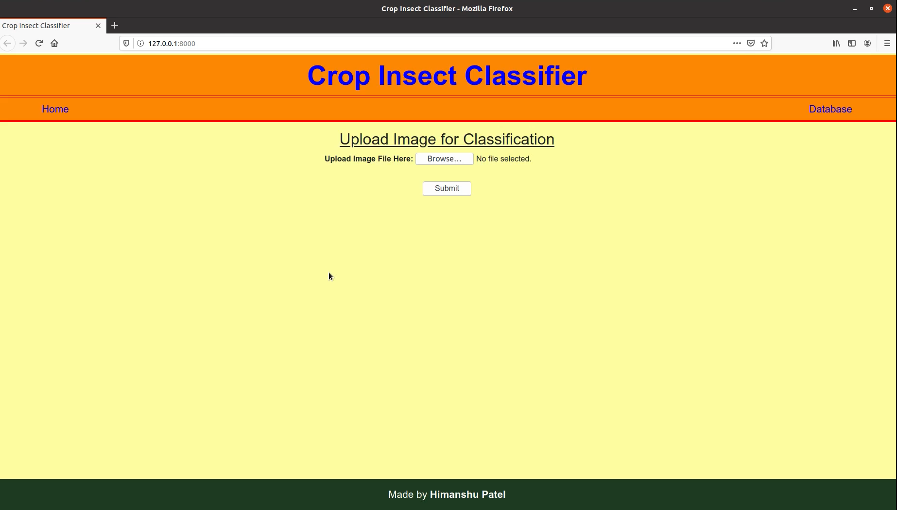
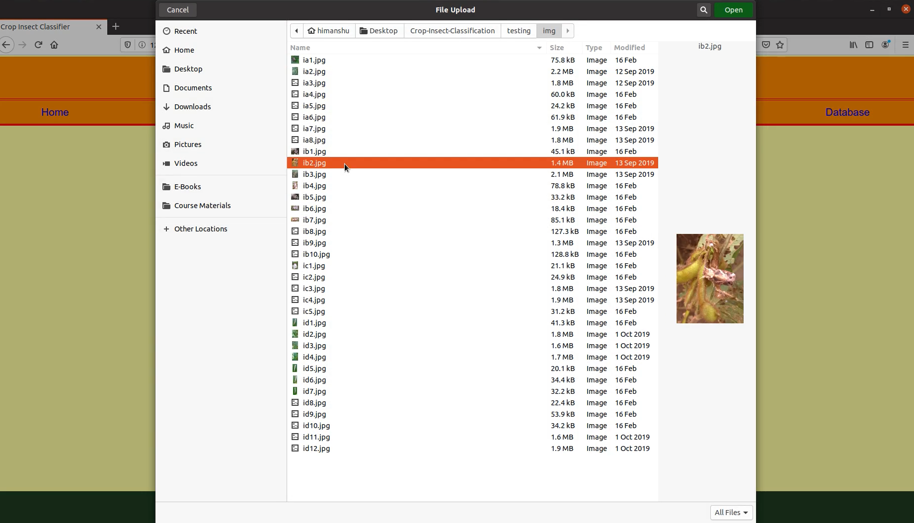
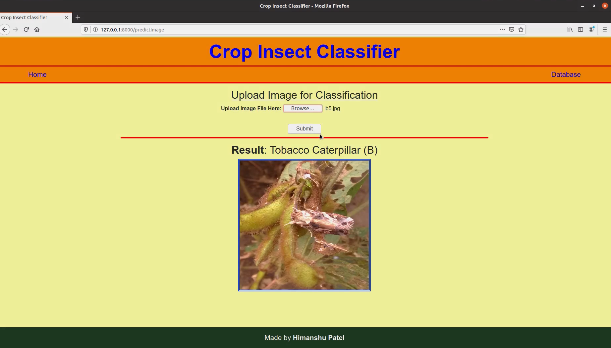
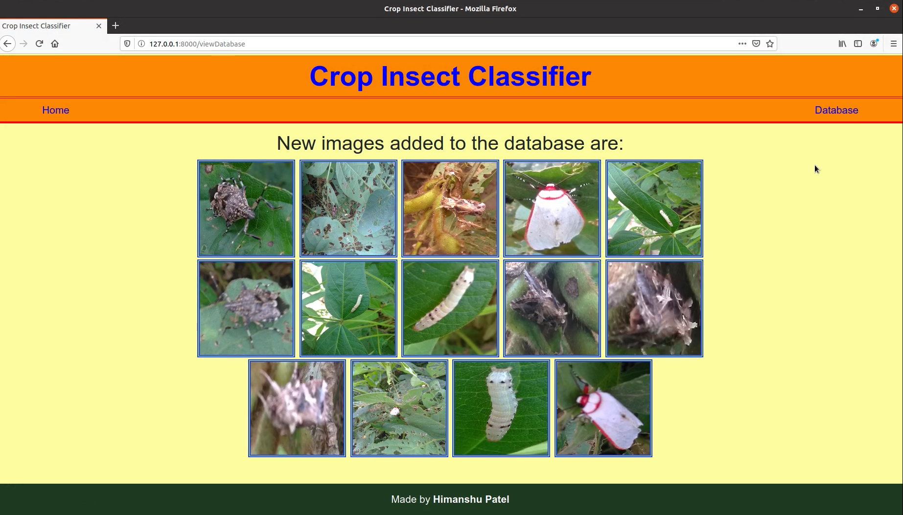

# Insect Classifier WebApp

1. Install python package `virtualenv` (if it is not installed), using **`pip install virtualenv`**.
1. Create a virtual environment in desired directory, using **`python3 -m venv my_env`**, where `my_env` is the name of your virtual environment. You can replace it with any other name of your choice.
1. Now activate your virtual environment using **`source my_env/bin/activate`**.
1. Clone the files from the repo using **`https://github.com/patel-himanshu/Insect-Classifier-WebApp`**.
1. Install all the dependencies using **`pip install -r requirements.txt`**.
1. Run the web app using **`python manage.py runserver`**.
1. The development server starts at **`localhost:8000`**. Enter the URL in your browser to visit the web app.
1. To stop the development server, press **CTRL + C** in the terminal window.

# Images of the Web App

